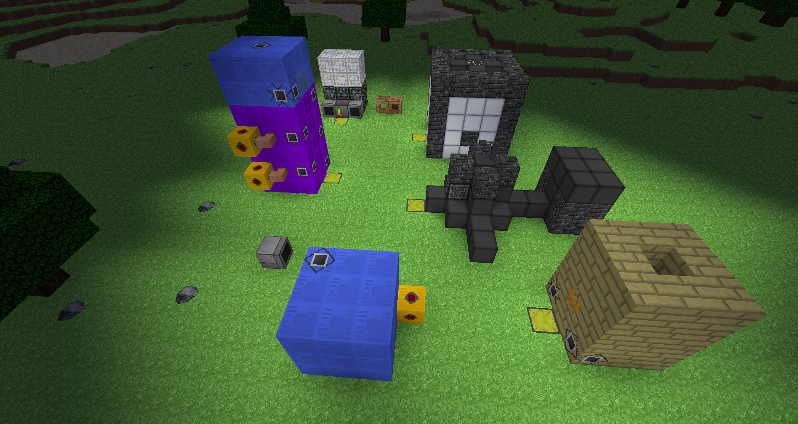
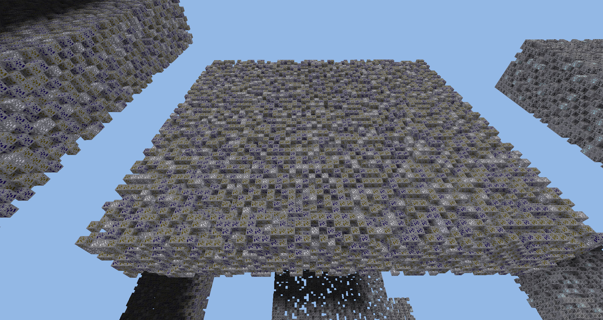

# Trinium

Work-in-Progress technological and magical (sub)game for
[Minetest](https://github.com/minetest/minetest).

Copyright (c) 2018 Wizzerine <wizzerine@gmail.com> and contributors.

## This game is not finished
* Don't expect it to work as well as finished one will;
* Don't expect it to not break compatibility in next update, including API one
 (however, I'll try to avoid API breakage);
* Please report any bugs (debug.txt is sometimes useful).

## Compatibility
Requires Minetest 0.5, translation-compatible build recommended.

## Features
* Fantastic Ore and Map Generation System (WIP)
* Realistic (petro)chemistry
* Research system
* Pulse Network, my approach to storage systems (not done yet)
* Some kind of Tinkers' Construct port
* Multiblocks
* **Feature-Requests are always welcome, and most of them will be implemented!**

## More Screenshots
#### Ore Generation

Note that all stone in this world is replaced with air in order to show the
 actual vein.
